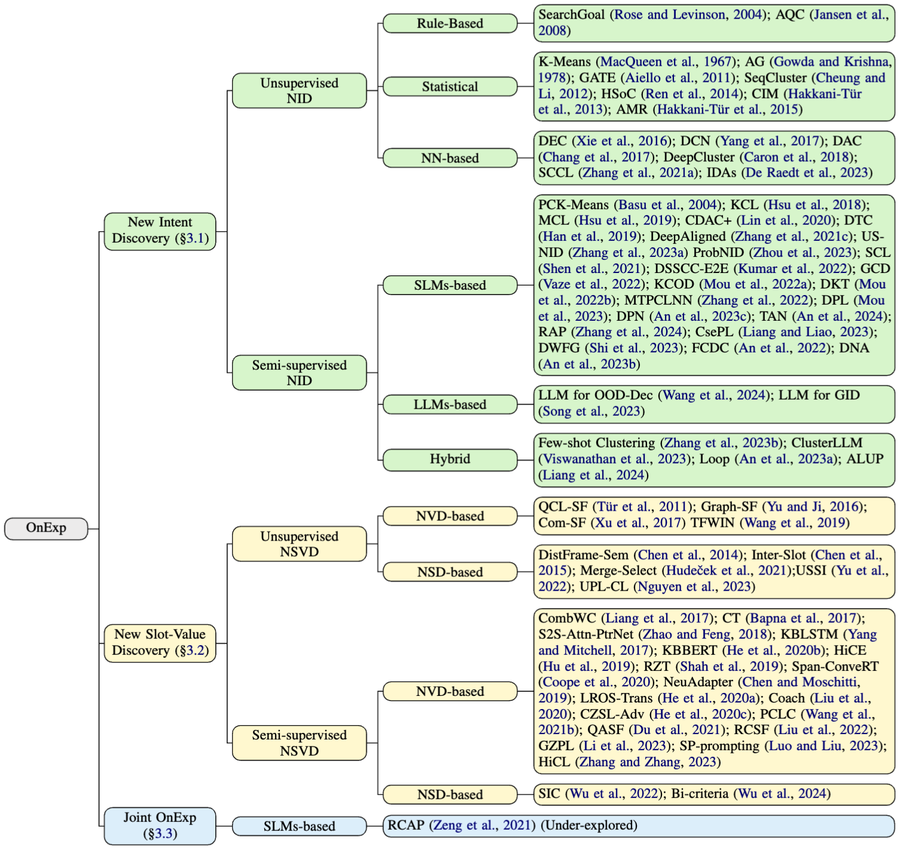
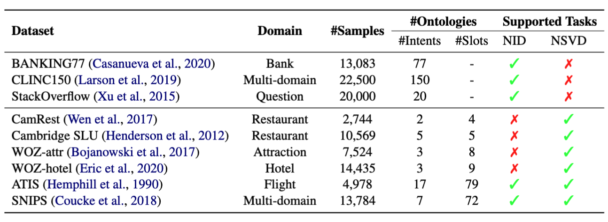

# Ontology Expansion Survey

## Taxonomy
We summarize related research papers and resources for ontology expansion (OnExp). We categorize OnExp into New Intent Discovery (NID), New Slot-Value Discovery (NSVD),  and Joint OnExp, as illustrated in the following figure:

We  present a summary of the datasets widely used in OnExp tasks, as shown in the Table below.

## Table of Contents
- OnExp Methods
  - [New Intent Discovery](#new-intent-discovery)
    - [Unsupervised NID](#unsupervised-nid)
      - [Rule-based Methods](#rule-based-methods)
      - [Statistical Methods](#statistical-methods)
      - [NN-based Methods](#nn-based-methods)
    - [Semi-supervised NID](#semi-supervised-nid)
      - [SLMs-based Methods](#slms-based-methods)
      - [LLMs-based Methods](#llms-based-methods)
      - [Hybrid Methods](#hybrid-methods)
  - [New Slot-Value Discovery](#new-slot-value-discovery)
    - [Unsupervised NSVD](#unsupervised-nsvd)
      - [NVD-based Methods](#nvd-based-methods)
      - [NSD-based Methods](#nsd-based-methods)
    - [Semi-supervised NSVD](#semi-supervised-nsvd)
      - [NVD-based Methods](#nvd-based-methods)
      - [NSD-based Methods](#nvd-based-methods)
  - [Joint Ontology Expansion](#joint-ontology-expansion)
      - [SLMs-based Methods](#slms-based-ethods)
    
<!-- - Benchmark Datasets
  - [Knowledge Base-based Datasets](#knowledge-base-based-datasets)
  - [Text-based Datasets](#text-based-datasets)
  - [Visual-based Datasets](#visual-based-datasets) -->
  
## New Intent Discovery
### Unsupervised NID
#### Rule-based Methods

1. **Understanding user goals in web search.** 
   *Daniel E. Rose and Danny Levinson.* 
   WWW, 2004. 
   [[Paper]](http://facweb.cs.depaul.edu/mobasher/classes/csc575/papers/www04--rose.pdf)
2. **Determining the informational, navigational, and transactional intent of web queries.** 
   *Bernard J. Jansen, Danielle L. Booth, and Amanda Spink.* 
   Inf, Process, Manag, 2008. 
   [[Paper]](https://www.researchgate.net/profile/Jim_Jansen/publication/222824696_Determining_the_Informational_Navigational_and_Transactional_Intent_of_Web_Queries/links/59e62b5245851598a13a5b30/Determining-the-Informational-Navigational-and-Transactional-Intent-of-Web-Queries.pdf)

#### Statistical Methods
1. **Some methods for classification and analysis of multivariate observations.** 
   *James MacQueen.* 
   In
Proceedings of the fifth Berkeley symposium on mathematical statistics and probability, 1976. 
   [[Paper]](https://www.cs.cmu.edu/~bhiksha/courses/mlsp.fall2010/class14/macqueen.pdf)
2. **Agglomerative clustering using the concept of mutual nearest neighbourhood.** 
   *K. Chidananda Gowda and G. Krishna.*
   Pattern Recognit, 1978
   [[Paper]](https://link.springer.com/chapter/10.1007/978-3-030-30793-6_22) 
3. **Behavior-driven clustering of queries into topics.** 
   *Luca Maria Aiello, Debora Donato, Umut Ozertem, Filippo Menczer.*
   CIKM, 2011.
   [[Paper]](https://www.researchgate.net/profile/Luca-Aiello-2/publication/221613367_Behavior-driven_clustering_of_queries_into_topics/links/5475cfe70cf245eb43710ca9/Behavior-driven-clustering-of-queries-into-topics.pdf) 
4. **Sequence clustering and labeling for unsupervised query intent discovery.** 
   *Jackie Chi Kit Cheung, Xiao Li.*
   WSDM, 2012.
   [[Paper]](https://citeseerx.ist.psu.edu/document?repid=rep1&type=pdf&doi=53e5ccd4bf104a9f32b49a378506af7dbb59aa45) 
5. **Heterogeneous graph-based intent learning with queries, web pages and wikipedia concepts.** 
   *Xiang Ren, Yujing Wang, Xiao Yu, Jun Yan, Zheng Chen, Jiawei Han.*
   WSDM, 2014.
   [[Paper]](https://citeseerx.ist.psu.edu/document?repid=rep1&type=pdf&doi=0021a5eebca0a44a7900e68154fc65690db5d7b0) 
6. **A weakly-supervised approach for discovering new user intents from search query logs.** 
   *Dilek Hakkani-Tür, Asli Celikyilmaz, Larry P. Heck, Gökhan Tür.*
   INTERSPEECH, 2013.
   [[Paper]](https://www.microsoft.com/en-us/research/wp-content/uploads/2016/02/IS13-Dilek.pdf) 
7. **Clustering novel intents in a conversational interaction system with semantic parsing.** 
   *Dilek Hakkani-Tür, Yun-Cheng Ju, Geoffrey Zweig, Gökhan Tür.*
   INTERSPEECH, 2015.
   [[Paper]](https://www.researchgate.net/profile/Dilek-Hakkani-Tur/publication/305719953_Clustering_Novel_Intents_in_a_Conversational_Interaction_System_with_Semantic_Parsing/links/579b7f7008ae5d5e1e137f89/Clustering-Novel-Intents-in-a-Conversational-Interaction-System-with-Semantic-Parsing.pdf) 

#### NN-based Methods
1. **Unsupervised deep embedding for clustering analysis.** 
   *Junyuan Xie, Ross B. Girshick, Ali Farhadi.*
   ICML, 2016.
   [[Paper]](https://proceedings.mlr.press/v48/xieb16.pdf) 
2. **Leveraging knowledge bases in lstms for improving machine reading.** 
   *Bishan Yang, Tom M. Mitchell.*
   ACL, 2017
   [[Paper]](https://arxiv.org/pdf/1902.09091) 
3. **Deep adaptive image clustering.** 
   *Jianlong Chang, Lingfeng Wang, Gaofeng Meng, Shiming Xiang, Chunhong Pan.*
   ICCV, 2017.
   [[Paper]](https://openaccess.thecvf.com/content_ICCV_2017/papers/Chang_Deep_Adaptive_Image_ICCV_2017_paper.pdf) 
4. **Deep clustering for unsupervised learning of visual features.** 
   *Mathilde Caron, Piotr Bojanowski, Armand Joulin, Matthijs Douze.*
   ECCV, 2018.
   [[Paper]](https://openaccess.thecvf.com/content_ECCV_2018/papers/Mathilde_Caron_Deep_Clustering_for_ECCV_2018_paper.pdf) 
5. **Supporting clustering with contrastive learning.** 
   *Dejiao Zhang, Feng Nan, Xiaokai Wei, Shang-Wen Li, Henghui Zhu, Kathleen R. McKeown, Ramesh Nallapati, Andrew O. Arnold, Bing Xiang.*
   NAACL, 2021.
   [[Paper]](https://arxiv.org/pdf/2103.12953) 
6. **IDAS: Intent discovery with abstractive summarization.** 
   *Maarten De Raedt, Fréderic Godin, Thomas Demeester, Chris Develder.*
   NLP4ConvAI, 2023.
   [[Paper]](https://aclanthology.org/2023.nlp4convai-1.7.pdf) 

### Semi-supervised NID
#### SLMs-based Methods 
1. **Active semi-supervision for pairwise constrained clustering.** 
   *Sugato Basu, Arindam Banerjee, Raymond J. Mooney.*
   SDM, 2004.
   [[Paper]](https://epubs.siam.org/doi/pdf/10.1137/1.9781611972740.31) 
2. **Learning to cluster in order to transfer across domains and tasks.** 
   *Yen-Chang Hsu, Zhaoyang Lv, Zsolt Kira.*
   ICLR, 2018
   [[Paper]](https://arxiv.org/pdf/1711.10125) 
3. **Multi-class classification without multi-class labels.** 
   *Yen-Chang Hsu, Zhaoyang Lv, Joel Schlosser, Phillip Odom, Zsolt Kira.*
   ICLR, 2019.
   [[Paper]](https://arxiv.org/pdf/1901.00544) 
4. **Discovering new intents via constrained deep adaptive clustering with cluster refinement.** 
   *Ting-En Lin, Hua Xu, Hanlei Zhang.*
   AAAI, 2020.
   [[Paper]](https://scholar.google.com/scholar_url?url=https://aaai.org/ojs/index.php/AAAI/article/download/6353/6209&hl=zh-CN&sa=T&oi=gsr-r-gga&ct=res&cd=0&d=4733090174077329507&ei=eSZoZsPtE9S-6rQP_NO1gAc&scisig=AFWwaebpGSueUPNxIXOM8Kw0jc9-) 
5. **Learning to discover novel visual categories via deep transfer clustering.** 
   *Kai Han, Andrea Vedaldi, Andrew Zisserman.*
   ICCV, 2019.
   [[Paper]](https://openaccess.thecvf.com/content_ICCV_2019/papers/Han_Learning_to_Discover_Novel_Visual_Categories_via_Deep_Transfer_Clustering_ICCV_2019_paper.pdf) 
6. **Discovering new intents with deep aligned clustering.** 
   *Hanlei Zhang, Hua Xu, Ting-En Lin, Rui Lyu.*
   AAAI, 2021.
   [[Paper]](https://scholar.google.com/scholar_url?url=https://ojs.aaai.org/index.php/AAAI/article/download/17689/17496&hl=zh-CN&sa=T&oi=gsr-r-gga&ct=res&cd=0&d=11251184876482376417&ei=FydoZp71KPu06rQP4r6OiAs&scisig=AFWwaeY8-K68Uw6oWwtkv_TQDtP6) 
7. **A Clustering Framework for Unsupervised and Semi-supervised New Intent Discovery.** 
   *Hanlei Zhang, Huanlin Xu, Xin Wang, Fei Long, Kai Gao.*
   TKDE, 2023.
   [[Paper]](https://arxiv.org/pdf/2304.07699.pdf) 
8. **A Probabilistic Framework for Discovering New Intents.** 
   *Yunhua Zhou, Guofeng Quan, Xipeng Qiu.*
   ACL, 2023.
   [[Paper]](https://aclanthology.org/2023.acl-long.209) 
9. **Semi-supervised intent discovery with contrastive learning.** 
   *Xiang Shen, Yinge Sun, Yao Zhang, Mani Najmabadi.*
   NLP4CONVAI, 2021.
   [[Paper]](https://aclanthology.org/2021.nlp4convai-1.12.pdf) 
10. **Intent detection and discovery from user logs via deep semi-supervised contrastive clustering.** 
    *Rajat Kumar, Mayur Patidar, Vaibhav Varshney, Lovekesh Vig, Gautam Shroff.*
    NAACL, 2021.
    [[Paper]](https://aclanthology.org/2022.naacl-main.134.pdf) 
11. **Generalized category discovery.** 
    *Sagar Vaze, Kai Han† Andrea Vedaldi, Andrew Zisserman.*
    CVPR, 2022.
    [[Paper]](https://openaccess.thecvf.com/content/CVPR2022/papers/Vaze_Generalized_Category_Discovery_CVPR_2022_paper.pdf) 
12. **Watch the neighbors: A unified k-nearest neighbor contrastive learning framework for OOD intent discovery.** 
    *Yutao Mou, Keqing He, Pei Wang, Yanan Wu, Jingang Wang, Wei Wu, Weiran Xu.*
    EMNLP, 2022.
    [[Paper]](https://arxiv.org/pdf/2210.08909) 
13. **Disentangled knowledge transfer for OOD intent discovery with unified contrastive learning.** 
    *Yutao Mou, Keqing He, Yanan Wu, Zhiyuan Zeng, Hong Xu, Huixing Jiang, Wei Wu, Weiran Xu.*
    ACL, 2022.
    [[Paper]](https://aclanthology.org/2022.acl-short.6.pdf) 
14. **New intent discovery with pre-training and contrastive learning.** 
    *Yuwei Zhang, Haode Zhang, Li-Ming Zhan, Xiao-Ming Wu, Albert Y. S. Lam.*
    ACL, 2022.
    [[Paper]](https://arxiv.org/pdf/2205.12914) 
15. **Decoupling Pseudo Label Disambiguation and Representation Learning for Generalized Intent Discovery.** 
    *Yutao Mou, Xiaoshuai Song, Keqing He, Chen Zeng, Pei Wang, Jingang Wang, Yunsen Xian, Weiran Xu.*
    ACL, 2023.
    [[Paper]](https://arxiv.org/pdf/2305.17699) 
16. **Generalized category discovery with decoupled prototypical network.** 
    *Wenbin An, Feng Tian, Qinghua Zheng, Wei Ding, Qianying Wang, Ping Chen.*
    AAAI, 2023.
    [[Paper]](https://scholar.google.com/scholar_url?url=https://ojs.aaai.org/index.php/AAAI/article/download/26475/26247&hl=zh-CN&sa=T&oi=gsr-r-gga&ct=res&cd=0&d=11040419122803603627&ei=GEhoZueVLtS-6rQP_NO1gAc&scisig=AFWwaebCvJMQ0IIA0TeWLYkch9Rh) 
17. **Transfer and alignment network for generalized category discovery.** 
    *Wenbin An, Feng Tian, Wenkai Shi, Yan Chen, Yaqiang Wu, Qianying Wang, Ping Chen.*
    AAAI, 2024.
    [[Paper]](https://scholar.google.com/scholar_url?url=https://ojs.aaai.org/index.php/AAAI/article/view/28959/29824&hl=zh-CN&sa=T&oi=gsr-r-gga&ct=res&cd=0&d=8536887000896637734&ei=ZUhoZo_UG43A6rQPjqSPmAY&scisig=AFWwaeZc8oEMswIKUY3QlWSIhzyb) 
18. **New Intent Discovery with Attracting and Dispersing Prototype.** 
    *Shun Zhang, Jian Yang, Jiaqi Bai, Chaoran Yan, Tongliang Li, Zhao Yan, Zhoujun Li.*
    LREC/COLING, 2024.
    [[Paper]](https://arxiv.org/pdf/2403.16913) 
19. **ClusterPrompt: Cluster semantic enhanced prompt learning for new intent discovery.** 
    *Jinggui Liang, Lizi Liao.*
    EMNLP Findings, 2023.
    [[Paper]](https://ink.library.smu.edu.sg/cgi/viewcontent.cgi?article=9587&context=sis_research) 
20. **A diffusion weighted graph framework for new intent discovery.** 
    *Wenkai Shi, Wenbin An, Feng Tian, Qinghua Zheng, Qianying Wang, Ping Chen.*
    EMNLP, 2023.
    [[Paper]](https://arxiv.org/pdf/2310.15836) 
21. **Fine-grained category discovery under coarse-grained supervision with hierarchical weighted self-contrastive learning.** 
    *Wenbin An, Feng Tian, Ping Chen, Siliang Tang, Qinghua Zheng, Qianying Wang.*
    EMNLP, 2022.
    [[Paper]](https://arxiv.org/pdf/2210.07733) 
22. **DNA: Denoised neighborhood aggregation for fine-grained category discovery.** 
    *Wenbin An, Feng Tian, Wenkai Shi, Yan Chen, Qinghua Zheng, Qianying Wang, Ping Chen.*
    EMNLP, 2023.
    [[Paper]](https://arxiv.org/pdf/2310.10151) 

#### LLMs-based Methods 
1. **Beyond the Known: Investigating LLMs Performance on Out-of-Domain Intent Detection.** 
   *Pei Wang, Keqing He, Yejie Wang, Xiaoshuai Song, Yutao Mou, Jingang Wang, Yunsen Xian, Xunliang Cai, Weiran Xu.*
   LREC/COLING, 2024.
   [[Paper]](https://arxiv.org/pdf/2402.17256) 
2. **Large Language Models Meet Open-World Intent Discovery and Recognition: An Evaluation of ChatGPT.** 
   *Xiaoshuai Song, Keqing He, Pei Wang, Guanting Dong, Yutao Mou, Jingang Wang, Yunsen Xian, Xunliang Cai, Weiran Xu.*
   EMNLP, 2023.
   [[Paper]](https://arxiv.org/pdf/2310.10176) 

#### Hybrid Methods 
1. **Clusterllm: Large language models as a guide for text clustering.** 
   *Yuwei Zhang, Zihan Wang, Jingbo Shang.*
   EMNLP, 2023.
   [[Paper]](https://arxiv.org/pdf/2305.14871) 
2. **Large language models enable few-shot clustering.** 
   *ijay Viswanathan, Kiril Gashteovski, Carolin Lawrence, Tongshuang Wu, Graham Neubig.*
   [[Paper]](https://arxiv.org/pdf/2307.00524) 
3. **Generalized Category Discovery with Large Language Models in the Loop.** 
   *Wenbin An, Wenkai Shi, Feng Tian, Haonan Lin, Qianying Wang, Yaqiang Wu, Mingxiang Cai, Luyan Wang, Yan Chen, Haiping Zhu, Ping Chen.*
   [[Paper]](https://arxiv.org/pdf/2312.10897v1) 
4. **Actively Learn from LLMs with Uncertainty Propagation for Generalized Category Discovery.** 
   *Jinggui Liang, Lizi Liao, Hao Fei, Bobo Li, Jing Jiang.*
   NAACL, 2024.
   [[Paper]](https://liziliao.github.io/papers/NAACL_24_ALUP__Camera_Ready.pdf) 

## New Slot-Value Discovery
### Unsupervised NSVD
#### NVD-based Methods
1. **Towards unsupervised spoken language understanding: Exploiting query click logs for slot filling.** 
   *Gökhan Tür, Dilek Hakkani-Tür, Dustin Hillard, Asli Celikyilmaz.*
   INTERSPEECH, 2011.
   [[Paper]](https://www.microsoft.com/en-us/research/wp-content/uploads/2011/08/Gokhan-IS11.pdf) 
2. **Unsupervised person slot filling based on graph mining.** 
   *Dian Yu, Heng Ji.*
   ACL, 2016.
   [[Paper]](https://aclanthology.org/P16-1005.pdf) 
3. **Unsupervised Slot Filler Refinement via Entity Community Construction.** 
   *Zengzhuang Xu, Rui Song, Bowei Zou, Yu Hong.*
   NLPCC, 2017.
   [[Paper]](http://tcci.ccf.org.cn/conference/2017/papers/1077.pdf) 
4. **A novel unsupervised approach for precise temporal slot filling from incomplete and noisy temporal contexts.** 
   *Xueying Wang, Haiqiao Zhang, Qi Li, Yiyu Shi, Meng Jiang.*
   WWW, 2019.
   [[Paper]](https://par.nsf.gov/servlets/purl/10132904) 

#### NSD-based Methods
1. **Leveraging frame semantics and distributional semantics for unsupervised semantic slot induction in spoken dialogue systems.** 
   *Yun-Nung Chen, William Yang Wang, Alexander I. Rudnicky.*
   SLT, 2014.
   [[Paper]](https://www.csie.ntu.edu.tw/~yvchen/doc/SLT14_SlotInduction.pdf) 
2. **Jointly modeling inter-slot relations by random walk on knowledge graphs for unsupervised spoken language understanding.** 
   *Yun-Nung Chen, William Yang Wang, Alexander I. Rudnicky.*
   NAACL, 2015.
   [[Paper]](https://aclanthology.org/N15-1064.pdf) 
3. **Discovering Dialogue Slots with Weak Supervision.** 
   *Vojtech Hudecek, Ondrej Dusek, Zhou Yu.*
   ACL/IJCNLP, 2021.
   [[Paper]](https://aclanthology.org/2021.acl-long.189.pdf) 
4. **Unsupervised slot schema induction for task-oriented dialog.** 
   *Dian Yu, Mingqiu Wang, Yuan Cao, Izhak Shafran, Laurent El Shafey, Hagen Soltau.*
   NAACL, 2022.
   [[Paper]](https://arxiv.org/pdf/2205.04515) 
5. **Slot Induction via Pre-trained Language Model Probing and Multi-level Contrastive Learning.** 
   *Hoang H. Nguyen, Chenwei Zhang, Ye Liu, Philip S. Yu.*
   SIGDIAL, 2023.
   [[Paper]](https://arxiv.org/pdf/2308.04712) 

### Semi-supervised NSVD
#### NVD-based Methods
1. **Combining Word-Level and Character-Level Representations for Relation Classification of Informal Text.** 
   *Dongyun Liang, Weiran Xu, Yinge Zhao.*
   Rep4NLP@ACL, 2017.
   [[Paper]](https://aclanthology.org/W17-2606.pdf) 
2. **Towards zero-shot frame semantic parsing for domain scaling.** 
   *Ankur Bapna, Gökhan Tür, Dilek Hakkani-Tür, Larry P. Heck.*
   INTERSPEECH, 2017.
   [[Paper]](https://arxiv.org/pdf/1707.02363) 
3. **Improving slot filling in spoken language understanding with joint pointer and attention.** 
   *Lin Zhao, Zhe Feng.*
   ACL, 2018.
   [[Paper]](https://aclanthology.org/P18-2068.pdf) 
4. **Leveraging knowledge bases in lstms for improving machine reading.** 
   *Bishan Yang, Tom M. Mitchell.*
   ACL, 2017.
   [[Paper]](https://arxiv.org/pdf/1902.09091) 
5. **Learning to tag OOV tokens by integrating contextual representation and background knowledge.** 
   *Keqing He, Yuanmeng Yan, Weiran Xu.*
   ACL, 2020.
   [[Paper]](https://aclanthology.org/2020.acl-main.58.pdf) 
6. **Few-shot representation learning for out-of-vocabulary words.** 
   *Ziniu Hu, Ting Chen, Kai-Wei Chang, Yizhou Sun.*
   ACL, 2019.
   [[Paper]](https://arxiv.org/pdf/1907.00505) 
7. **Robust zero-shot cross-domain slot filling with example values.** 
   *Darsh J. Shah, Raghav Gupta, Amir A. Fayazi, Dilek Hakkani-Tür.*
   ACL, 2019.
   [[Paper]](https://arxiv.org/pdf/1906.06870) 
8. **Span-ConveRT: Few-shot span extraction for dialog with pretrained conversational representations.** 
   *Sam Coope, Tyler Farghly, Daniela Gerz, Ivan Vulic, Matthew Henderson.*
   ACL, 2020.
   [[Paper]](https://arxiv.org/pdf/2005.08866) 
9. **Transfer learning for sequence labeling using source model and target data.** 
   *Lingzhen Chen, Alessandro Moschitti.*
   AAAI, 2019.
   [[Paper]](https://scholar.google.com/scholar_url?url=https://ojs.aaai.org/index.php/AAAI/article/download/4586/4464&hl=zh-CN&sa=T&oi=gsr-r-gga&ct=res&cd=0&d=7656242682906742870&ei=hWpoZtrXA66p6rQPit2GkAE&scisig=AFWwaeZLBDQCH8Q5PE6YP-5j_S8R) 
10. **Learning label-relational output structure for adaptive sequence labeling.** 
   *Keqing He, Yuanmeng Yan, Hong Xu, Sihong Liu, Zijun Liu, Weiran Xu.*
   IJCNN, 2020.
   [[Paper]](http://vigir.missouri.edu/~gdesouza/Research/Conference_CDs/IEEE_WCCI_2020/IJCNN/Papers/N-20791.pdf) 
11. **Coach: A coarse-to-fine approach for cross-domain slot filling.** 
   *Zihan Liu, Genta Indra Winata, Peng Xu, Pascale Fung.*
   ACL, 2020.
   [[Paper]](https://arxiv.org/pdf/2004.11727) 
12. **Contrastive zero-shot learning for cross-domain slot filling with adversarial attack.** 
   *Keqing He, Jinchao Zhang, Yuanmeng Yan, Weiran Xu, Cheng Niu, Jie Zhou.*
   COLING, 2020.
   [[Paper]](https://aclanthology.org/2020.coling-main.126.pdf) 
13. **Bridge to target domain by prototypical contrastive learning and label confusion: Re-explore zero-shot learning for slot filling.** 
   *Liwen Wang, Xuefeng Li, Jiachi Liu, Keqing He, Yuanmeng Yan, Weiran Xu.*
   EMNLP, 2021.
   [[Paper]](https://arxiv.org/pdf/2110.03572) 
14. **QA-driven zero-shot slot filling with weak supervision pretraining.** 
   *Xinya Du, Luheng He, Qi Li, Dian Yu, Panupong Pasupat, Yuan Zhang.*
   ACL/IJCNLP, 2021.
   [[Paper]](https://aclanthology.org/2021.acl-short.83.pdf) 
15. **Cross-domain slot filling as machine reading comprehension: A new perspective.** 
   *Jian Liu, Mengshi Yu, Yufeng Chen, Jinan Xu.*
   IEEE ACM Trans. Audio Speech Lang. Process, 2022.
   [[Paper]](https://ieeexplore.ieee.org/document/9670742) 
16. **Generative zero-shot prompt learning for cross-domain slot filling with inverse prompting.** 
   *Xuefeng Li, Liwen Wang, Guanting Dong, Keqing He, Jinzheng Zhao, Hao Lei, Jiachi Liu, Weiran Xu.*
   ACL Findings, 2023.
   [[Paper]](https://arxiv.org/pdf/2307.02830) 
17. **Zero-shot slot filling with slot-prefix prompting and attention relationship descriptor.** 
   *Qiaoyang Luo, Lingqiao Liu.*
   AAAI, 2023.
   [[Paper]](https://scholar.google.com/scholar_url?url=https://ojs.aaai.org/index.php/AAAI/article/download/26566/26338&hl=zh-CN&sa=T&oi=gsr-r-gga&ct=res&cd=0&d=11710869742608609211&ei=12xoZq6AF7qY6rQP7_eJmAo&scisig=AFWwaeay1qDSkGOdfz7DOSqoOFRO) 
18. **HierarchicalContrast: A Coarse-to-Fine Contrastive Learning Framework for Cross-Domain Zero-Shot Slot Filling.** 
   *Junwen Zhang, Yin Zhang.*
   EMNLP Findings, 2023.
   [[Paper]](https://arxiv.org/pdf/2310.09135) 

#### NSD-based Methods
1. **Semi-supervised new slot discovery with incremental clustering.** 
   *Yuxia Wu, Lizi Liao, Xueming Qian, Tat-Seng Chua.*
   EMNLP Findings, 2022.
   [[Paper]](https://aclanthology.org/2022.findings-emnlp.462.pdf) 
2. **Active discovering new slots for task-oriented conversation.** 
   *Yuxia Wu, Tianhao Dai, Zhedong Zheng, Lizi Liao.*
   IEEE ACM Trans. Audio Speech Lang. Process, 2024.
   [[Paper]](https://arxiv.org/pdf/2305.04049) 

## Joint Ontology Expansion
### SLMs-based Methods
1. **Automatic intent-slot induction for dialogue systems.** 
   *Zengfeng Zeng, Dan Ma, Haiqin Yang, Zhen Gou, Jianping Shen.*
   WWW, 2021.
   [[Paper]](https://arxiv.org/pdf/2103.08886) 
